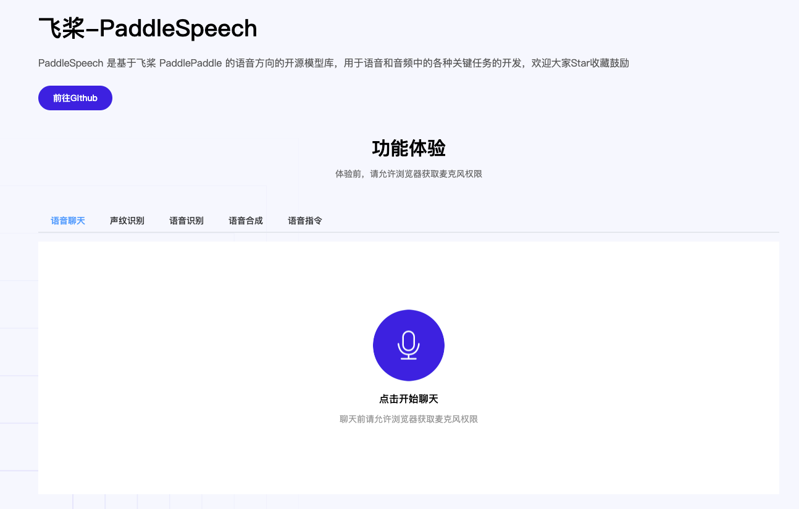

# Paddle Speech Demo

PaddleSpeechDemo是一个以PaddleSpeech的语音交互功能为主体开发的Demo展示项目，用于帮助大家更好的上手PaddleSpeech以及使用PaddleSpeech构建自己的应用。

智能语音交互部分使用PaddleSpeech，对话以及信息抽取部分使用PaddleNLP，网页前端展示部分基于Vue3进行开发

主要功能：

+ 语音聊天：PaddleSpeech的语音识别能力+语音合成能力，对话部分基于PaddleNLP的闲聊功能
+ 声纹识别：PaddleSpeech的声纹识别功能展示
+ 语音识别：支持【实时语音识别】，【端到端识别】，【音频文件识别】三种模式
+ 语音合成：支持【流式合成】与【端到端合成】两种方式
+ 语音指令：基于PaddleSpeech的语音识别能力与PaddleNLP的信息抽取，实现交通费的智能报销

运行效果：

 

## 安装

### 拉取项目

```
# 拉取项目
git clone https://github.com/iftaken/PaddleSpeechDemo.git

# 进入项目
cd PaddleSpeechDemo

# 拉取PaddleSpeech项目
git clone https://github.com/PaddlePaddle/PaddleSpeech.git
```

### 后端环境安装

```
# 安装环境
cd PaddleSpeechServer
pip install -r requirements.txt

# 下载 ie 模型，针对地点进行微调，效果更好
cd source
mkdir model & cd model
wget https://bj.bcebos.com/paddlenlp/applications/speech-cmd-analysis/finetune/model_state.pdparams
```


### 前端环境安装

前端依赖node.js ，需要提前安装，确保npm可用

```
# 进入前端目录
cd PaddleSpeechWebClient

# 安装yarn，已经安装
npm install -g yarn

# 使用yarn安装前端依赖
yarn install
```


## 启动服务

### 开启后端服务

```
cd PaddleSpeechServer
# 默认8010端口
python main.py --port 8010
```

### 开启前端服务

```
cd PaddleSpeechWebClient
yarn dev --port 8011
```

默认配置下，前端中配置的后台地址信息是localhost，确保后端服务器和前端在同一台机器上，不在一台机器的配置方式见下方的FAQ部分

## FAQ 


## 参考资料

vue实现录音参考资料：https://blog.csdn.net/qq_41619796/article/details/107865602#t1

前端流式播放音频参考仓库：

https://github.com/AnthumChris/fetch-stream-audio

https://bm.enthuses.me/buffered.php?bref=6677

